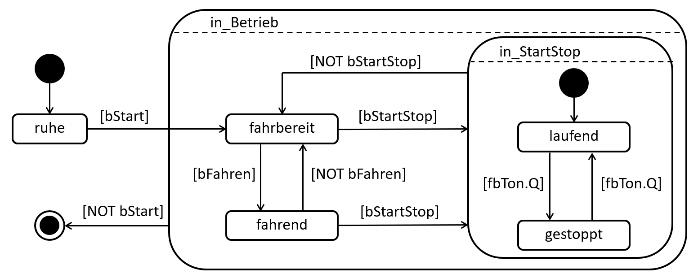

# Aufgabe: Motorprogrammierung per UML-Zustandsdiagramm

## Worum es geht
Für die Simulation des Demo-Racks sollst du eine Motorsteuerung als einen Funktionsbaustein *FB_Motor* programmieren. Folgende Spezifikation liegt dir bereits vor:



Es sollen drei boolsche Variablen als Input definiert werden, welche die Bedingungen für die Transitionen der Zustände definieren:

- **bStart**: Freigabe der Steuerung
- **bFahren**: Manuelles Einschalten des Motors
- **bStartStop**: Einschalten des Start-Stopp-Modus

Folgende interne Variablen werden benötigt:

```
bMotorEnable  AT%Q*  : BOOL;
nMotorVelo    AT%Q*  : INT;
fbTon                : TON;
```

Damit der Motor im Zustand *fahrbereit* auch fahrbereit ist, soll die Motorgeschwindigkeit (**nMotorVelo**) hier auf 1000 gesetzt werden. Im Zustand *fahrend* soll der Motor durch das setzen 
der Variable **bMotorEnable** eingeschaltet werden. Wird der Zustand verlassen, so soll auch der Motor wieder stoppen. Im Start-Stopp-Modus soll der Motor abwechselnd für jeweils 2 Sekunden 
in den Zuständen *laufend* und *gestoppt* verweilen und dann wechseln. Hierfür ist ein TON-Baustein namens *fbTon* angedacht. Wird der Start-Stopp-Modus deaktiviert, so soll der Motor aus 
Sicherheitsgründen erstmal gestoppt werden.

Beim Erstellen eines Funktionsbausteins oder einer Funktion in TwinCAT war dir aufgefallen, dass statt der Programmiersprache Strukturierter Text (ST), auch die Programmierung per UML-Zustandsdiagramm 
ausgewählt werden kann. Da hier das UML-Zustandsdiagramm schon fast in kompletter Form vorliegt, entschließt du dich die Implementierung der Motorsteuerung auch mit einem UML-Zustandsdiagramm zu machen,
statt alles in ST zu übersetzten.

## UML-Zustandsdiagramme in TwinCAT
Die Programmierung von UML-Zustandsdiagrammen in TwinCAT hat einige Besonderheiten im Vergleich zur Programmierung mit ST.
In dem Deklarationsblock werden, wie auch in ST, die benötigen Ein-, Ausgangs- und internen Variablen deklariert. Im Unterschied zu ST findet im unteren Block jedoch die graphische Programmierung 
per UML-Zustandsdiagramm statt. Hierfür finden sich auf der rechten Seite im Reiter *Toolbox/Werkzeuge* alle mögliche Bausteine, wie Zustände oder Entscheidungen, die per Drag & Drop eingefügt 
werden können. Wird die Maus nach dem Einfügen eines Zustands über diesen bewegt, so erscheinen kleine Buttons, mit denen Entry-, Do- und Exit-Teile eingefügt werden können. Mit einem Doppelklick 
auf die Teile, können die Aktionen dieser als Programmcode in ST in das Feld geschrieben werden, wie Beispielsweise:

```
nMotorVelo := 1000;
```
um die Motorgeschwindigkeit auf 1000 zu setzten. Hierbei können auch mehrere Befehle einfach hintereinander geschrieben werden. Mit einem Rechtsklick auf den Teil und das anschließende Klicken auf 
*Löschen*, kann ein falsch platzierter Teil entfernt werden. Klickt man einen Zustand an, erscheint ein Button mit einem Pfeil. Mit diesem können Transitionen eingefügt werden. Als Bedingung dieser 
wird automatisch *TRUE* eingesetzt. Durch einen Doppelklick darauf, kann diese bearbeitet werden.

> [!CAUTION]
> Das hier zu implementierende UML-Zustandsdiagramm muss für die Ausführbarkeit in TwinCAT leicht abgeändert werden, denn der Compiler kann nicht alles übersetzen. Folgende drei Punkte sind zu beachten:
> 1. In jedem zusammengesetzten Zustand muss es einen Start- und einen Endzustand geben.
> 2. Es ist untersagt Transitionen von Zuständen außerhalb eines zusammengesetzten Zustands zu Zuständen innerhalb eines zusammengesetzten Zustands oder umgekehrt zu implementieren.
> 3. Abschlusstransitionen von zusammengesetzten Zuständen sind ohne Bedingung.

> [!TIP]
> Um 2. zu umgehen, muss die Transition von dem Zustand außerhalb direkt zum zusammengesetzten Zustand erfolgen. In diesem befindet sich (aufgrund von 1.) notwendigerweise ein Startzustand,
> welcher durch eine Transition ohne Bedingung mit dem gewünschten Zustand innerhalb des zusammengesetzten Zustandes verbunden wird. Mit diesem Trick kann dieselbe Funktionsweise erfüllt werden, wie eine
> direkte Transition. Gleiches kann auch für den umgekehrten Weg gemacht werden.

## Aufgabenstellung
Folgendes soll hier gemacht werden:

1. Lade die Simulation des Demo-Racks aus ILIAS herunter.
3. Öffne die Simulation in TwinCAT.
4. Erstelle einen neuen Funktionsbaustein *FB_Motor* in der SPS *PLC_Rack*. Wähle als Implementierungssprache "UML-Zustandsdiagramm" aus.
5. Implementiere die Funktionsweise nach dem obigen Bild und beachte dabei die Anmerkungen zu UML-Zustandsdiagrammen in TwinCAT.
6. Deklariere anschließend den *FB_Motor* im Main-Programm und gib die Schalter S10, S11 und S12 als entsprechende Inputs an.
7. Erstelle das Projekt, verknüpfe die Variablen und aktiviere die Konfiguration.
8. Wechsle in den Online-Modus und teste den Funktionsbaustein.

Verhält sich der Motor entsprechend der Anforderungen, so hast du die Aufgabe erfolgreich gelöst.
