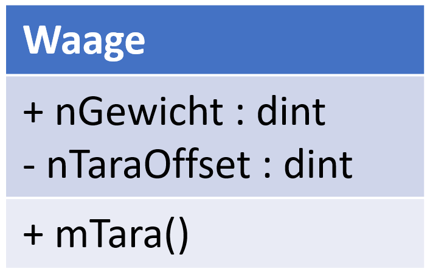

## Aufgabe: Erstellen einer Klasse für eine Waage

### Worum es geht
In dieser Programmierübung soll das Erstellen von Objekten einer selbst implementierten Klasse mit Eigenschaften und Methoden angewendet werden. Dazu soll eine simple Ansteuerung für die Waage des Demo-Racks objektorientiert programmiert werden.

### Projektanforderung
Ziel ist es eine Klasse *Waage* zu erstellen. Es ist ein UML Klassendiagramm gegeben. Anhand dieses Diagramms soll die Funktionsweise für die Demo-Rack-Simulation implementiert werden. 

	

Folgende Anmerkungen gibt es zum Diagramm:

- `mTara()` soll die Waage kalibrieren, sodass der aktuell gemessene Wert 0 wird
- `nGewicht` hat nur einen lesenden Zugriff und enthält den kalibrierten Messwert der Waage
- `nTaraOffset` beschreibt den Messwert, ab dem durch die Kalibrierung der Wert 0 angenommen wird

Das gemessene Gewicht wird in der Klasse als interner Eingang eingelesen. Hierzu muss der Eingang mit `GVL_Out.SimLoadCell_Term07_Value` verknüpft werden.

Im Main-Programm soll ein Objekt der Klasse *Waage* instanziiert werden. Die Tara-Methode soll durch einen Schalter/Taster ausgelöst werden. Die Funktionsweise soll mit Hilfe der Digitalanzeige überprüft werden.

> [!TIP]
> Im Dokument `Arbeiten mit dem Demo-Rack` im ILIAS findest du in Kapitel 8.2 eine Übersicht zu den Variablen in der Simulation, falls du nochmal nachschauen magst.

### Vorgehen
1. Lade dir aus dem ILIAS die Rack-Simulation herunter und öffne sie.
2. Erstelle die Klasse nach den Vorgaben.
3. Implementiere die Main-Funktion nach den Vorgaben.
4. Erstelle dein Projekt und verknüpfe Ein- und Ausgänge.
5. Aktiviere die Konfiguration und starte den Run-Modus.
6. Logge dich in beide SPS ein und starte diese.
7. Teste die Funktionsweise und korrigiere gegebenenfalls.

### Teste deine Lösung
Deine Lösung ist dann richtig, wenn:

- die Waage nach dem Start beim roten Gewicht *21* und beim schwarzen Gewicht *26* anzeigt.
- nach dem Auslösen der Tara-Methode in jedem Fall *0* ausgegeben wird.
